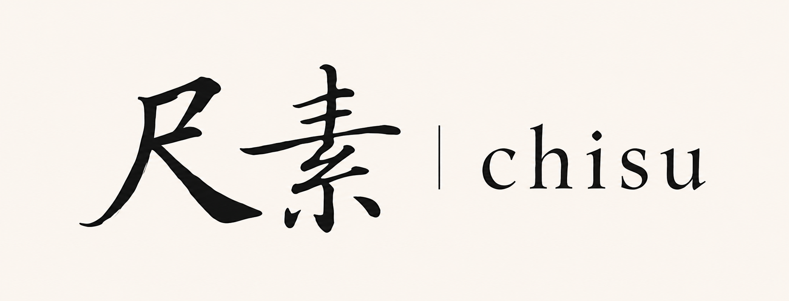
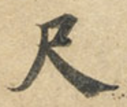
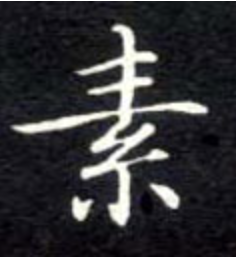

# 0. 视觉与命名逻辑

这部分不是“好看就行”的审美描述，而是产品叙事的一部分。

你给出的这组字样，核心价值不在于“写得像书法”，而在于它把产品气质直接定在了三个关键词上：

- 文气
- 雅致
- 有手工感，但不做旧

## 0.1 为什么用“尺素”

“尺素”本身就比常规产品名更有文学性，但它不浮夸。

它有几个好处：

| 设计点 | 作用 |
|---|---|
| 尺素 | 传统书信与短札的意象，天然对应“内容生成”而不是“机械输出” |
| chisu | 现代、克制、可产品化，避免完全掉进古风腔 |
| 中英并置 | 既保留文化气质，也让品牌在技术语境里可读 |

这比那种一上来就堆“国风、仙气、雅韵”的命名要高明得多。后者很容易廉价；前者是克制的。

## 0.2 为什么选这种字形

这组字明显借了钟绍京《灵飞经》一系的小楷气质：细、活、稳，带一点游丝感，但不拖泥带水。

它适合 AI 产品的原因是：

1. 它有“人写出来的温度”
2. 它不靠夸张笔势博眼球
3. 它和曲词 / 曲艺这种需要文脉与节制的产品定位一致

换句话说，这不是书法展览的字形，而是产品身份识别的一部分。

## 0.3 这个视觉语言要传达什么

我建议把视觉语言理解成一句话：

**不是“古风 AI”，而是“有文化分寸感的创作工具”。**

所以它应该：

- 有传统的笔意
- 但版式必须现代
- 有雅致的审美
- 但不能让人觉得只是在“装古典”

## 0.4 具体落地规则

| 元素 | 建议 |
|---|---|
| 字体 | 标题可用偏宋/衬线风格，正文保持清晰 sans / serif 混排 |
| 色彩 | 纸色、墨黑、少量朱红，不要大面积高饱和装饰色 |
| 留白 | 留白要足，给“内容”和“证据”呼吸空间 |
| 图形 | 少用复杂纹样，多用线性、印章感、章法感 |
| 气质 | 克制、轻、干净，不要做成民俗博物馆风 |

## 0.5 为什么这要写进研报

因为品牌语言会影响产品判断。

如果你的视觉系统在讲“文雅、传统、可信”，那么产品就不能同时去卖“秒出成品、无需修改、自动登台”的幻想。

视觉语言和产品承诺必须一致，否则一眼就会穿帮。

这也是为什么这份研报会一直坚持一个主线：

**先做可控的创作助手，再谈自动化成品。**

这组图的意义，不只是“字好看”，而是它把整个产品的气质锚定在“有文脉、但不陈旧；有技术、但不冰冷”的中间地带。

